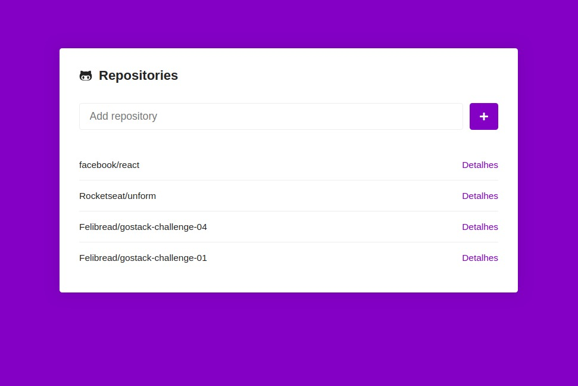
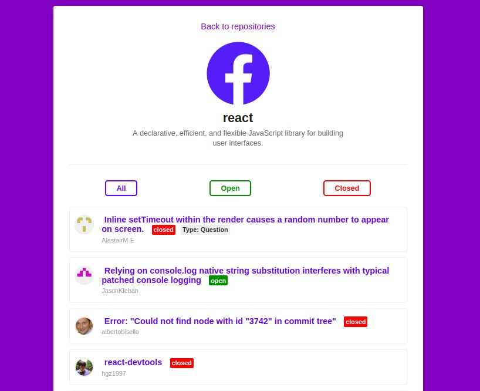

# Rocketseat:rocket: <a href="https://github.com/Rocketseat/bootcamp-gostack-desafio-05#desafio-05-aplica%C3%A7%C3%A3o-com-reactjs">Challenge 05</a>

This one was hard. I mostly evolved my understanding about state management in React.




## Run this project

Install the dependencies

Yarn
```bash
yarn
```

---

Npm
```bash
npm install
```

---

Start the app

Yarn
```bash
yarn start
```

---

Npm
```bash
npm start
```

----
